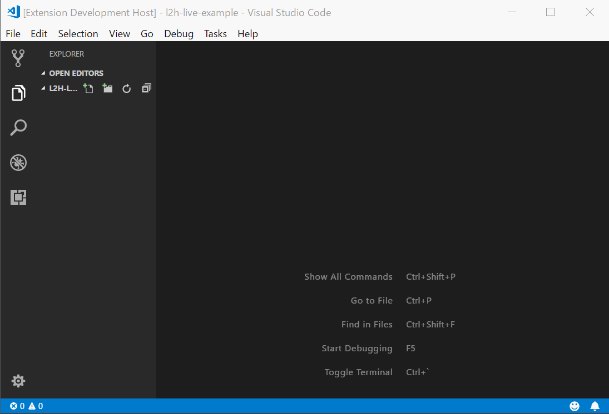

# l2h-live



Live-preview for LaTeX document using [michael-brade/LaTeX.js](https://github.com/michael-brade/LaTeX.js)

## Features

- By using [LaTeX.js](https://github.com/michael-brade/LaTeX.js); stand-alone JavaScript LaTeX to HTML converter,
  you could preview LaTeX document in VSCode without any external program.

## Requirements

Just install the extension into your VSCode.

Note: At the moment this is BETA version and unpublished. I don't know how to install manually. See Development/Contribution.

## Extension Settings

## Known Issues

- Ths is BETA version.
- The quality of preview depends on the implementation of LaTeX.js.
  If you contribute to LaTeX.js, also it would be help for this extension.

## Release Notes

## Development and Contribution

You could try to develop this extension. After forking [Github repository](https://github.com/project-pp/l2h-live), :

```
$ git clone git@github.com:your-github-account/l2h-live.git
$ cd l2h-live
$ npm i -S -D
$ code .
```

[Issues](https://github.com/project-pp/l2h-live/issues) or [PR](https://github.com/project-pp/l2h-live/pulls) are welcome.
Please share your idea with us!

## License

[MIT](https://github.com/project-pp/l2h-live/blob/master/LICENSE)